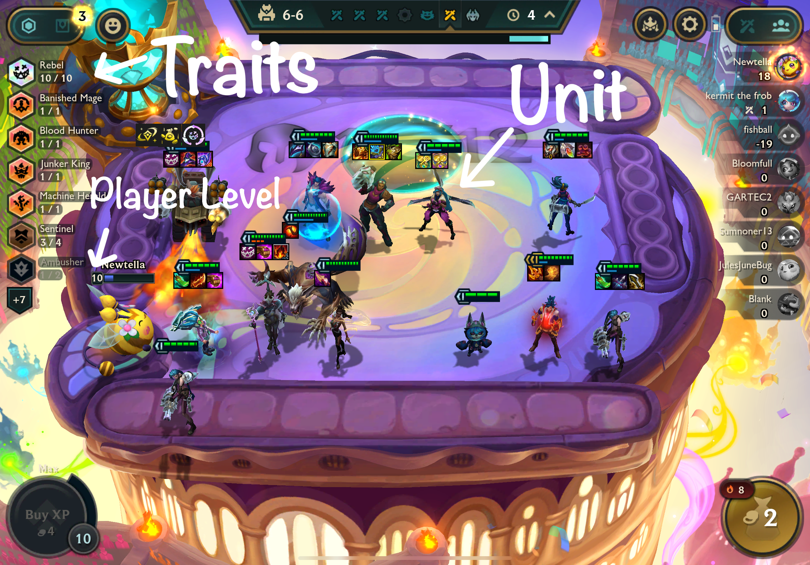

```{r, echo=FALSE, warning=FALSE, message=FALSE}
# Install necessary packages (if not already installed)
# install.packages(c("rvest", "tidyverse", "stringr", "purrr"))
# install.packages("GGally")
# install.packages("plotly")
# install.packages("kableExtra")
# install.packages("randomForest")

library(GGally)
library(rvest)
library(tidyverse)
library(dplyr)
library(purrr)
library(stringr)
library(jsonlite)
library(kableExtra)
library(tidyr)
library(ggplot2)
library(knitr)
library(gridExtra)
library(jsonlite)
library(tibble)
library(mgcv)
library(randomForest)
```

# Github Link:

https://github.com/Newtella3105/Teamfight-Tactics-JSC370

# Introduction

This project analyzes champion and trait data from **Teamfight Tactics (TFT)** Sets 12 and 13 to understand how changes in champion cost and design influence balance and performance. TFT, developed by Riot Games, is an auto-battler game where players strategically build teams of champions that automatically fight in a series of combat rounds. Each new "set" introduces fresh units, traits, and mechanics that reshape the meta-game. 

Set 13 introduced a major change: **6-cost champions** with **exclusive 4-star upgrades**, expanding the power curve beyond the previous 5-cost maximum. This project aims to investigate how this design shift affects champion statistics, value efficiency, and trait-level impact on performance outcomes.

# Background

In TFT, eight players face off in a round-robin format. Each player assembles a team of **champions** (also known as **units**) drawn from a shared shop. These units battle autonomously on a hexagonal **board** against other players’ teams.

## Key Concepts and Definitions

- **Unit**: A controllable champion with traits, abilities, and stats.
- **Trait**: A label representing a champion’s role or origin (e.g., "Mage", "Bruiser"). Traits activate bonuses when multiple units share the same trait, creating **synergies**.
- **Cost**: The gold price to buy a unit (1–6). Higher-cost units are rarer and typically stronger.
- **Star Level**: Units can be upgraded:
  - 3 × 1-star → 2-star
  - 3 × 2-star → 3-star
  - 3 × 3-star → 4-star   
  The higher the star level, the stronger each attribute and ability of the unit becomes.
- **Health**: Total damage a unit can absorb.
- **Damage**: Damage dealt per basic attack.
- **DPS (Damage Per Second)**: Average damage output per second.
- **Player Level**: Determines how many units a player can deploy (max: 10) and affects odds of finding high-cost units in the shop.
- **Combat Round**: A fight phase where units act automatically.

```{r, echo=FALSE, warning=FALSE, message=FALSE, out.width="\\textwidth"}

```

# Scope and Unit of Analysis

The dataset includes win and top4 rates for thousands of team **compositions** (not individual units). (Note: win rate refers to the Top 1 Rate, i.e., the proportion of games where a composition finishes first. Each composition is a unique arrangement of champions and traits. Thus:

- **Each observation is a team composition**.
- **Performance metrics (win/top4 rate) are per composition**.
- To analyze **unit-level impact**, we decompose each composition into its champions and traits, then compute **average performance** for each unit or trait based on all compositions it appears in.  
  These are not raw per-unit win rates but are **derived values** from aggregate composition performance.

# Research Questions

- How do champion stats (health, damage, DPS) scale with cost in Set 13 compared to Set 12, and how does this affect win rate?
- How does the distribution of win rates vary across champion cost tiers and traits?
- Are normalized stats (stat divided by total cost at star level) predictive of win rate?
- Which predictors (stats, traits, or both) best explain champion-level win rate?
- Which model type (LM, GAM, RF) performs best in predicting win rate across sets and inputs?

# Hypotheses

- The introduction of 6-cost champions in Set 13 creates a significant win rate advantage over lower-cost units.
- While high-cost units have greater absolute stats, low-cost units offer better stat efficiency and may perform better relative to cost.
- Champion stat scaling across star levels is consistent across sets, suggesting win rate differences stem from design changes rather than inflation.
- Traits are stronger predictors of win rate than raw stats, due to synergy bonuses that impact team-level performance.
- Random Forest models will outperform LM and GAM in predicting win rate due to their ability to model nonlinear interactions between stats and traits.

# Methods

The primary data sources for this project were:

- **[TFTactics.gg](https://tftactics.gg)**: Used to scrape champion and trait data, including base stats (health, damage, DPS) and trait descriptions.
- **[TFTactics Meta Report Endpoint](https://tftactics-data.kda.gg/meta/report)**: Used to scrape win rate and top4 rate for full team compositions, available via the JSON structure `data$summary-section`.

Data were collected for **Set 12** and **Set 13** using a combination of R tools (`rvest`, `jsonlite`, `stringr`, etc.) and archived through the [Wayback Machine](https://web.archive.org) to ensure consistency after TFT site updates.

## Data Wrangling

Once the data was acquired, the following steps were taken:

### Cleaning Champion and Trait Names

Champion and trait names were cleaned by removing artifacts such as "TFT | Guide" using string operations like `str_remove_all()` to standardize text across sources.

### Handling Missing Data

No missing values were identified in the scraped champion and trait data.

### Filtering Invalid Traits

Due to a scraping error in Set 12, many champions were incorrectly assigned a "Portal" trait with no type. These were filtered out, and only valid trait-typed rows were retained.

### Composition Win Rate Source

Win and top4 rates for team compositions were extracted from:
- **[https://tftactics-data.kda.gg/meta/report](https://tftactics-data.kda.gg/meta/report)**  
This endpoint returns JSON data with composition performance metrics for ranked games, including the list of champions in each composition and their aggregate performance.

### Composition Decomposition

Each composition was split into individual champion and trait components. For each champion or trait, we then computed **average win/top4 rates across all compositions in which they appeared**. These derived statistics allow us to model unit-level performance from team-level data.

### Modeling Approach

To assess how well champion stats and traits predict composition-level win rate, we implemented three modeling frameworks:

- **Linear Models (LM)**: To estimate linear relationships between predictors (stats and/or traits) and win rate.
- **Generalized Additive Models (GAM)**: To capture non-linear effects of continuous variables like health and DPS using smooth functions.
- **Random Forest (RF)**: A non-parametric ensemble model used to capture complex interactions between traits and stats with improved predictive performance.

Each model was trained on unit-level datasets, where each row represents a champion along with the average win rate across all compositions in which it appears. Models were evaluated using $R^2$, RMSE, and AIC (where applicable).

# Variable Summary

The following table summarizes the key variables used in this analysis:

```{r, echo=FALSE, warning=FALSE, message=FALSE}
#############################################
# Variable Summary Table
#############################################

variable_summary <- data.frame(
  Variable = c("win_rate", "top4_rate", "cost", "health", "dps", "damage", "trait_*"),
  Type = c("Numeric", "Numeric", "Numeric", "Numeric", "Numeric", "Numeric", "Binary (0/1)"),
  Description = c(
    "Top 1 Rate — the proportion of games where the composition finished 1st",
    "Proportion of games where the composition placed in the top 4",
    "Champion gold cost (ranges from 1 to 6)",
    "HP of the champion at each star level",
    "Damage per second (includes attack speed)",
    "Damage dealt per basic attack",
    "Dummy variable indicating whether a unit has a specific trait"
  )
)

kable(variable_summary, format = "latex", caption = "Table 1: Summary of Key Variables Used in Analysis", booktabs = TRUE) %>%
  kable_styling(latex_options = c("striped", "hold_position"), full_width = FALSE) %>%
  row_spec(0, bold = TRUE)
```

```{r, echo=FALSE, warning=FALSE, message=FALSE}
#############################################
# SET 12 - Wayback Machine Archive Data
#############################################

# Define the TFTTactics.gg Champions URL for Set 12
url_tfttactics_set12 <- "https://web.archive.org/web/20240927225144/https://tftactics.gg/champions/"
page_tfttactics_set12 <- read_html(url_tfttactics_set12)

# Extract champion names for Set 12
champion_names_set12 <- page_tfttactics_set12 %>%
  html_nodes(".character-name") %>% 
  html_text(trim = TRUE)

# Extract trait names (global list) for Set 12
trait_names_set12 <- page_tfttactics_set12 %>%
  html_nodes(".dropdown-item img") %>%
  html_attr("alt") 

# Initialize the tibbles with proper column names for Set 12
champion_info_set12 <- tibble(
  champion = character(),
  stats = list(),
  abilities = list(),
  traits = list(),
  trait_breakpoints = list()
)

trait_info_set12 <- tibble(
  champion = character(),
  trait_name = character(),
  trait_type = character(),
  trait_description = character()
)
```

```{r, echo=FALSE, warning=FALSE, message=FALSE}
#############################################
# SET 13 - Wayback Machine Archive Data
#############################################

# Define the TFTTactics.gg Champions URL for Set 13
url_tfttactics_set13 <- "https://web.archive.org/web/20250114220710/https://tftactics.gg/champions/"
page_tfttactics_set13 <- read_html(url_tfttactics_set13)

# Extract champion names for Set 13
champion_names_set13 <- page_tfttactics_set13 %>%
  html_nodes(".character-name") %>% 
  html_text(trim = TRUE)

# Extract trait names (global list) for Set 13
trait_names_set13 <- page_tfttactics_set13 %>%
  html_nodes(".dropdown-item img") %>%
  html_attr("alt") 

# Initialize the tibbles with proper column names for Set 13
champion_info_set13 <- tibble(
  champion = character(),
  stats = list(),
  abilities = list(),
  traits = list(),
  trait_breakpoints = list()
)

trait_info_set13 <- tibble(
  champion = character(),
  trait_name = character(),
  trait_type = character(),
  trait_description = character()
)
```

```{r, echo=FALSE, warning=FALSE, message=FALSE}
#############################################
# Common Functions (Used for both sets)
#############################################

# Function to safely read the page with error handling
safe_read_html <- function(url) {
  tryCatch(
    {
      read_html(url)
    },
    error = function(e) {
      message("Error reading URL: ", url)
      message("Error: ", e$message)
      NULL
    }
  )
}

# Function to extract champion data using regex patterns
extract_champion_data <- function(page, trait_names) {
  # Get raw HTML text
  raw_text <- page %>% html_text()
  
  # Extract champion name from the title
  champion_name <- page %>% 
    html_node("title") %>% 
    html_text() %>% 
    str_extract("^[^·]+") %>% 
    str_trim()
  
  # stats EXTRACTION
  stats <- tibble(stat = character(), value = character())
  stat_patterns <- list(
    "Cost" = "Cost:\\s*(\\d+)",
    "Health" = "Health:\\s*([\\d\\s\\/]+)",
    "Mana" = "Mana:\\s*(\\d+)",
    "Armor" = "Armor:\\s*(\\d+)",
    "MR" = "MR:\\s*(\\d+)",
    "DPS" = "DPS:\\s*([\\d\\s\\/]+)",
    "Damage" = "Damage:\\s*([\\d\\s\\/]+)",
    "Atk Spd" = "Atk Spd:\\s*([\\d\\.]+)",
    "Crit Rate" = "Crit Rate:\\s*([\\d\\.%]+)",
    "Range" = "Range:\\s*(\\d+)"
  )
  
  for (stat_name in names(stat_patterns)) {
    value <- str_extract(raw_text, stat_patterns[[stat_name]])
    if (!is.na(value)) {
      clean_value <- str_replace(value, paste0(stat_name, ":\\s*"), "") %>% str_trim()
      stats <- stats %>% add_row(stat = stat_name, value = clean_value)
    }
  }
  
  # ABILITIES EXTRACTION
  ability_section <- str_extract(raw_text, "Abilities(.+?)(?=[A-Z][a-z]+(?:Origin|Class)|Synergies|Privacy Policy)")
  ability_name <- str_extract(ability_section, "(?<=Abilities)\\s*([A-Za-z\\s]+?)(?=Active|Passive)") %>% str_trim()
  ability_type <- str_extract(ability_section, "(Active|Passive)")
  ability_mana <- str_extract(ability_section, "\\d+\\s*\\/\\s*\\d+")

  abilities <- tibble(
    name = ability_name,
    type = ability_type,
    mana = ability_mana,
    description = NA_character_
  )

  # TRAITS EXTRACTION
  champion_traits <- character()
  for (trait in trait_names) {
    if (str_detect(raw_text, fixed(trait))) {
      champion_traits <- c(champion_traits, trait)
    }
  }

  traits <- tibble(name = character(), type = character(), description = character())
  trait_breakpoints <- tibble(trait_name = character(), breakpoint_value = character(), breakpoint_description = character())

  for (trait_name in champion_traits) {
    next_traits <- setdiff(trait_names, trait_name)
    next_part <- if (length(next_traits) > 0) paste(next_traits, collapse = "|") else ""

    end_pattern <- if (nchar(next_part) > 0) {
      paste0("(?=", next_part, "|Synergies)")
    } else {
      "(?=Synergies)"
    }

    trait_pattern <- paste0(trait_name, "(.+?)", end_pattern)
    trait_section <- str_extract(raw_text, trait_pattern)

    if (!is.na(trait_section)) {
      trait_type <- str_extract(trait_section, "(Origin|Class)")

      desc_pattern <- paste0("(?<=", trait_type, ")\\s*(.+?)(?=(", 
                             if(nchar(next_part) > 0) paste0(next_part, "|") else "", 
                             "Synergies|\\d+%|\\d+\\s*AD))")

      trait_desc <- str_extract(trait_section, desc_pattern) %>% str_trim()

      traits <- traits %>% add_row(
        name = trait_name,
        type = trait_type,
        description = trait_desc
      )

      breakpoint_pattern <- "(\\d+)(.+?)(?=\\d+|$)"
      breakpoint_matches <- str_extract_all(trait_section, breakpoint_pattern)[[1]]
      for (match in breakpoint_matches) {
        bp_value <- str_extract(match, "^\\d+") %>% str_trim()
        bp_desc <- str_replace(match, "^\\d+", "") %>% str_trim()
        trait_breakpoints <- trait_breakpoints %>% add_row(
          trait_name = trait_name,
          breakpoint_value = bp_value,
          breakpoint_description = bp_desc
        )
      }
    }
  }

  return(list(
    champion = champion_name,
    stats = stats,
    abilities = abilities,
    traits = traits,
    trait_breakpoints = trait_breakpoints
  ))
}

# Function to extract champion stats for analysis
extract_champion_stats <- function(champion_name, stats_tibble) {
  # Extract Cost, Health, DPS, and Damage stats
  cost <- stats_tibble %>% filter(stat == "Cost") %>% pull(value) %>% as.numeric()
  health <- stats_tibble %>% filter(stat == "Health") %>% pull(value)
  dps <- stats_tibble %>% filter(stat == "DPS") %>% pull(value)
  damage <- stats_tibble %>% filter(stat == "Damage") %>% pull(value)
  
  # Split the health, dps, and damage values by " / " to separate star levels
  health_values <- as.numeric(strsplit(health, " / ")[[1]])
  dps_values <- as.numeric(strsplit(dps, " / ")[[1]])
  damage_values <- as.numeric(strsplit(damage, " / ")[[1]])

  # Ensure that the number of values for health, dps, and damage match across star levels
  if (length(health_values) != length(dps_values) | length(dps_values) != length(damage_values)) {
    stop("Mismatch in the number of star levels for health, dps, and damage.")
  }
  
  # Create a tibble with the expanded stats
  stats_df <- tibble(
    champion = rep(champion_name, length(health_values)),
    star_level = 1:length(health_values),
    cost = rep(cost, length(health_values)),
    health = health_values,
    dps = dps_values,
    damage = damage_values
  )
  
  return(stats_df)
}
```

```{r, echo=FALSE, warning=FALSE, message=FALSE}
#############################################
# SET 12 - Extract All Champion Data
#############################################

extract_all_champion_data_set12 <- function(champion_names) {
  # Reset global variables
  champion_info_set12 <<- tibble(
    champion = character(),
    stats = list(),
    abilities = list(),
    traits = list(),
    trait_breakpoints = list()
  )

  trait_info_set12 <<- tibble(
    champion = character(),
    trait_name = character(),
    trait_type = character(),
    trait_description = character()
  )

  base_url <- "https://web.archive.org/web/20240927225144/https://tftactics.gg/champions/"

  for (champion_name in champion_names) {
    champion_url <- paste0(base_url, gsub(" ", "_", champion_name), "/")
    champion_page <- safe_read_html(champion_url)

    if (is.null(champion_page)) {
      next
    }

    champion_data <- extract_champion_data(champion_page, trait_names_set12)

    champion_info_set12 <<- champion_info_set12 %>% add_row(
      champion = champion_data$champion,
      stats = list(champion_data$stats),
      abilities = list(champion_data$abilities),
      traits = list(champion_data$traits),
      trait_breakpoints = list(champion_data$trait_breakpoints)
    )

    for (trait in champion_data$traits$name) {
      trait_info_set12 <<- trait_info_set12 %>% add_row(
        champion = champion_data$champion,
        trait_name = trait,
        trait_type = champion_data$traits$type[champion_data$traits$name == trait],
        trait_description = champion_data$traits$description[champion_data$traits$name == trait]
      )
    }
  }

  return(list(champion_info = champion_info_set12, trait_info = trait_info_set12))
}
```

```{r, echo=FALSE, warning=FALSE, message=FALSE}
#############################################
# SET 13 - Extract All Champion Data
#############################################

extract_all_champion_data_set13 <- function(champion_names) {
  # Reset global variables
  champion_info_set13 <<- tibble(
    champion = character(),
    stats = list(),
    abilities = list(),
    traits = list(),
    trait_breakpoints = list()
  )

  trait_info_set13 <<- tibble(
    champion = character(),
    trait_name = character(),
    trait_type = character(),
    trait_description = character()
  )

  base_url <- "https://tftactics.gg/champions/"

  for (champion_name in champion_names) {
    champion_url <- paste0(base_url, gsub(" ", "_", champion_name), "/")
    champion_page <- safe_read_html(champion_url)

    if (is.null(champion_page)) {
      next
    }

    champion_data <- extract_champion_data(champion_page, trait_names_set13)

    champion_info_set13 <<- champion_info_set13 %>% add_row(
      champion = champion_data$champion,
      stats = list(champion_data$stats),
      abilities = list(champion_data$abilities),
      traits = list(champion_data$traits),
      trait_breakpoints = list(champion_data$trait_breakpoints)
    )

    for (trait in champion_data$traits$name) {
      trait_info_set13 <<- trait_info_set13 %>% add_row(
        champion = champion_data$champion,
        trait_name = trait,
        trait_type = champion_data$traits$type[champion_data$traits$name == trait],
        trait_description = champion_data$traits$description[champion_data$traits$name == trait]
      )
    }
  }

  return(list(champion_info = champion_info_set13, trait_info = trait_info_set13))
}
```

```{r, echo=FALSE, warning=FALSE, message=FALSE}
#############################################
# Extract Data for Both Sets
#############################################
# Extract data for both sets
# all_data_set12 <- extract_all_champion_data_set12(champion_names_set12)
# all_data_set13 <- extract_all_champion_data_set13(champion_names_set13)
```

```{r, echo=FALSE, warning=FALSE, message=FALSE}
# Read the JSON files
champion_info_set12 <- fromJSON("data/champion_info_set12.json")
trait_info_set12 <- fromJSON("data/trait_info_set12.json")

# Initialize all_data_set_12 as an empty data frame
all_data_set12 <- list()

# Add the JSON data as columns to the new data frame
all_data_set12$champion_info <- champion_info_set12
all_data_set12$trait_info <- trait_info_set12
```

```{r, echo=FALSE, warning=FALSE, message=FALSE}
# Read the JSON files
champion_info_set13 <- fromJSON("data/champion_info_set13.json")
trait_info_set13 <- fromJSON("data/trait_info_set13.json")

# Initialize all_data_set_13 as an empty data frame
all_data_set13 <- list()

# Add the JSON data as columns to the new data frame
all_data_set13$champion_info <- champion_info_set13
all_data_set13$trait_info <- trait_info_set13
```


```{r, echo=FALSE, warning=FALSE, message=FALSE}
#############################################
# Process Data for Both Sets
#############################################
# Clean champion names for Set 12
all_data_set12$trait_info <- all_data_set12$trait_info %>%
  mutate(champion = str_remove_all(champion, "TFT | Guide")) %>%
  filter(!(trait_name == "Portal" & is.na(trait_type)))

all_data_set12$champion_info <- all_data_set12$champion_info %>%
  mutate(champion = str_remove_all(champion, "TFT | Guide"))

# Clean champion names for Set 13
all_data_set13$trait_info <- all_data_set13$trait_info %>%
  mutate(champion = str_remove_all(champion, "TFT | Guide"))

all_data_set13$champion_info <- all_data_set13$champion_info %>%
  mutate(champion = str_remove_all(champion, "TFT | Guide"))

# print(all_data_set12$trait_info)
# print(all_data_set12$champion_info)
# print(all_data_set13$trait_info)
# print(all_data_set13$champion_info)
```

```{r, echo=FALSE, warning=FALSE, message=FALSE}
#############################################
# SET 12 - Extract All Winrate Data
#############################################

# Read JSON
url_set12 <- "https://web.archive.org/web/20240917151936/https://tftactics-data.kda.gg/meta/report"
report_data_set12 <- fromJSON(url_set12)

# Go to the summary-section
summary_section_set12 <- report_data_set12$data$`summary-section`

# Helper function to clean a single name
clean_champion_name_set12 <- function(x) {
  x <- gsub("^[0-9]-", "", x)
  x <- gsub("^tft12_", "", x)
  x <- gsub("-[0-9]+$", "", x)
  x <- tolower(x)
  x <- gsub("_", " ", x)
  x <- tools::toTitleCase(x)
  x
}

# Build the dataframe
comp_df_set12 <- tibble(
  win_rate = summary_section_set12$win_rate,
  top4_rate = summary_section_set12$top4_rate,
  champions = sapply(summary_section_set12$composition, function(champs_vec) {
    cleaned_champions <- sapply(champs_vec, clean_champion_name_set12)
    paste(cleaned_champions, collapse = ", ")
  })
)

# Separate Champions from Traits
comp_df_clean_set12 <- comp_df_set12 %>%
  mutate(champions = str_split(champions, ",\\s*")) %>%
  rowwise() %>%
  mutate(
    champions_list = list(champions[champions %in% champion_names_set12]),
    traits_list = list(champions[!(champions %in% champion_names_set12)])
  ) %>%
  ungroup() %>%
  mutate(
    champions = sapply(champions_list, function(x) paste(x, collapse = ", ")),
    traits = sapply(traits_list, function(x) paste(x, collapse = ", "))
  ) %>%
  select(win_rate, top4_rate, champions, traits)

# print(comp_df_clean_set12)
```

```{r, echo=FALSE, warning=FALSE, message=FALSE}
#############################################
# SET 13 - Extract All Winrate Data
#############################################

# Download compressed file
temp_file_set13 <- tempfile(fileext = ".gz")
download.file(
  url = "https://web.archive.org/web/20250113142238/https://tftactics-data.kda.gg/meta/report",
  destfile = temp_file_set13,
  mode = "wb"
)

# Decompress using gzcon
con_set13 <- gzcon(file(temp_file_set13, "rb"))
text_set13 <- readLines(con_set13, warn = FALSE)
close(con_set13)

# Parse the text as JSON
report_data_set13 <- fromJSON(paste(text_set13, collapse = ""))

# Go to the summary-section
summary_section_set13 <- report_data_set13$data$`summary-section`

# Helper function to clean a single name
clean_champion_name_set13 <- function(x) {
  x <- gsub("^[0-9]-", "", x)
  x <- gsub("^tft13_", "", x)
  x <- gsub("-[0-9]+$", "", x)
  x <- tolower(x)
  x <- gsub("_", " ", x)
  x <- tools::toTitleCase(x)
  x
}

# Build the dataframe
comp_df_set13 <- tibble(
  win_rate = summary_section_set13$win_rate,
  top4_rate = summary_section_set13$top4_rate,
  champions = sapply(summary_section_set13$composition, function(champs_vec) {
    cleaned_champions <- sapply(champs_vec, clean_champion_name_set13)
    paste(cleaned_champions, collapse = ", ")
  })
)

# Separate Champions from Traits
comp_df_clean_set13 <- comp_df_set13 %>%
  mutate(champions = str_split(champions, ",\\s*")) %>%
  rowwise() %>%
  mutate(
    champions_list = list(champions[champions %in% champion_names_set13]),
    traits_list = list(champions[!(champions %in% champion_names_set13)])
  ) %>%
  ungroup() %>%
  mutate(
    champions = sapply(champions_list, function(x) paste(x, collapse = ", ")),
    traits = sapply(traits_list, function(x) paste(x, collapse = ", "))
  ) %>%
  select(win_rate, top4_rate, champions, traits)

# print(comp_df_clean_set13)
```

```{r, echo=FALSE, warning=FALSE, message=FALSE}
#############################################
# Analyze Set 12 and Set 13 Champion and Trait Stats
#############################################

# Explode champions and traits into separate rows

# For Set 12 - explode champions
comp_df_clean_set12_exploded <- comp_df_clean_set12 %>%
  mutate(
    champions = str_split(champions, ",\\s*")
  ) %>%
  unnest(champions) %>%
  mutate(
    champions = str_trim(champions)
  )

# For Set 13 - explode champions
comp_df_clean_set13_exploded <- comp_df_clean_set13 %>%
  mutate(
    champions = str_split(champions, ",\\s*")
  ) %>%
  unnest(champions) %>%
  mutate(
    champions = str_trim(champions)
  )

# For Set 12 - explode traits
comp_df_clean_set12_traits_exploded <- comp_df_clean_set12 %>%
  mutate(
    traits = str_split(traits, ",\\s*")
  ) %>%
  unnest(traits) %>%
  mutate(
    traits = str_trim(traits)
  )

# For Set 13 - explode traits
comp_df_clean_set13_traits_exploded <- comp_df_clean_set13 %>%
  mutate(
    traits = str_split(traits, ",\\s*")
  ) %>%
  unnest(traits) %>%
  mutate(
    traits = str_trim(traits)
  )

# Summarize Champion Stats
champion_summary_set12 <- comp_df_clean_set12_exploded %>%
  group_by(champions) %>%
  summarise(
    avg_win_rate = mean(win_rate, na.rm = TRUE),
    avg_top4_rate = mean(top4_rate, na.rm = TRUE),
    count = n(),
    .groups = "drop"
  )

champion_summary_set13 <- comp_df_clean_set13_exploded %>%
  group_by(champions) %>%
  summarise(
    avg_win_rate = mean(win_rate, na.rm = TRUE),
    avg_top4_rate = mean(top4_rate, na.rm = TRUE),
    count = n(),
    .groups = "drop"
  )

# Summarize Trait Stats
trait_summary_set12 <- comp_df_clean_set12_traits_exploded %>%
  group_by(traits) %>%
  summarise(
    avg_win_rate = mean(win_rate, na.rm = TRUE),
    avg_top4_rate = mean(top4_rate, na.rm = TRUE),
    count = n(),
    .groups = "drop"
  )

trait_summary_set13 <- comp_df_clean_set13_traits_exploded %>%
  group_by(traits) %>%
  summarise(
    avg_win_rate = mean(win_rate, na.rm = TRUE),
    avg_top4_rate = mean(top4_rate, na.rm = TRUE),
    count = n(),
    .groups = "drop"
  )

# champion_summary_set12
# champion_summary_set13
# trait_summary_set12
# trait_summary_set13
```

# Champion Stat Distribution (No Win Rate)

```{r, echo=FALSE, warning=FALSE, message=FALSE}
#############################################
# Analyze Set 12 Champion stats
#############################################

# Prepare champion stats for analysis (Set 12)
all_champion_stats_set12 <- bind_rows(
  lapply(1:nrow(all_data_set12$champion_info), function(i) {
    champion_name <- all_data_set12$champion_info$champion[i]
    champion_stats <- all_data_set12$champion_info$stats[[i]]
    
    # Extract and combine stats
    tryCatch({
      extract_champion_stats(champion_name, champion_stats)
    }, error = function(e) {
      message(paste("Error processing champion:", champion_name))
      message(e$message)
      # return(NULL)
    })
  })
)

# Remove any NULL entries
all_champion_stats_set12 <- all_champion_stats_set12 %>% filter(!is.na(champion))

# Arrange champions by various attributes (Set 12)
arranged_champions_set12 <- all_champion_stats_set12 %>%
  arrange(champion, star_level, cost)

# Compute averages for health, dps, and damage grouped by cost and star level (Set 12)
averaged_champions_set12 <- arranged_champions_set12 %>%
  group_by(cost, star_level) %>%
  summarise(
    avg_health = mean(health, na.rm = TRUE),
    avg_dps = mean(dps, na.rm = TRUE),
    avg_damage = mean(damage, na.rm = TRUE),
    .groups = 'drop'  # Drop grouping after summarisation
  )

# Sort tables by different metrics (Set 12)
ordered_by_health_set12 <- averaged_champions_set12 %>%
  arrange(avg_health) %>%
  mutate(
    avg_health = round(avg_health, 1),
    avg_dps = round(avg_dps, 1),
    avg_damage = round(avg_damage, 1)
  )

ordered_by_dps_set12 <- averaged_champions_set12 %>%
  arrange(avg_dps) %>%
  mutate(
    avg_health = round(avg_health, 1),
    avg_dps = round(avg_dps, 1),
    avg_damage = round(avg_damage, 1)
  )

ordered_by_damage_set12 <- averaged_champions_set12 %>%
  arrange(avg_damage) %>%
  mutate(
    avg_health = round(avg_health, 1),
    avg_dps = round(avg_dps, 1),
    avg_damage = round(avg_damage, 1)
  )
```

```{r, echo=FALSE, warning=FALSE, message=FALSE}
#############################################
# Analyze Set 13 Champion stats
#############################################

# Prepare champion stats for analysis (Set 13)
all_champion_stats_set13 <- bind_rows(
  lapply(1:nrow(all_data_set13$champion_info), function(i) {
    champion_name <- all_data_set13$champion_info$champion[i]
    champion_stats <- all_data_set13$champion_info$stats[[i]]
    
    # Extract and combine stats
    tryCatch({
      extract_champion_stats(champion_name, champion_stats)
    }, error = function(e) {
      message(paste("Error processing champion:", champion_name))
      message(e$message)
      # return(NULL)
    })
  })
)

# Remove any NULL entries
all_champion_stats_set13 <- all_champion_stats_set13 %>% filter(!is.na(champion))

# Arrange champions by various attributes (Set 13)
arranged_champions_set13 <- all_champion_stats_set13 %>%
  arrange(champion, star_level, cost)

# Compute averages for health, dps, and damage grouped by cost and star level (Set 13)
averaged_champions_set13 <- arranged_champions_set13 %>%
  group_by(cost, star_level) %>%
  summarise(
    avg_health = mean(health, na.rm = TRUE),
    avg_dps = mean(dps, na.rm = TRUE),
    avg_damage = mean(damage, na.rm = TRUE),
    .groups = 'drop'  # Drop grouping after summarisation
  )

# Sort tables by different metrics (Set 13)
ordered_by_health_set13 <- averaged_champions_set13 %>%
  arrange(avg_health) %>%
  mutate(
    avg_health = round(avg_health, 1),
    avg_dps = round(avg_dps, 1),
    avg_damage = round(avg_damage, 1)
  )

ordered_by_dps_set13 <- averaged_champions_set13 %>%
  arrange(avg_dps) %>%
  mutate(
    avg_health = round(avg_health, 1),
    avg_dps = round(avg_dps, 1),
    avg_damage = round(avg_damage, 1)
  )

ordered_by_damage_set13 <- averaged_champions_set13 %>%
  arrange(avg_damage) %>%
  mutate(
    avg_health = round(avg_health, 1),
    avg_dps = round(avg_dps, 1),
    avg_damage = round(avg_damage, 1)
  )
```

## Set 12: Stats by Cost and Star Level

```{r, echo=FALSE, warning=FALSE, message=FALSE, fig.width=12}
#############################################
# Create Visualizations for Set 12
#############################################

# Scatterplots for Set 12
set12_health_scatter <- ggplot(arranged_champions_set12, aes(x = as.factor(cost), y = health, color = as.factor(star_level))) +
  geom_point(alpha = 0.7) +
  geom_smooth(method = "lm", aes(group = as.factor(star_level)), se = FALSE) +
  labs(title = "Health by Cost and Star Level", x = "Cost", y = "Health", color = "Star Level") +
  theme_minimal() +
  scale_color_brewer(palette = "Set1")

set12_damage_scatter <- ggplot(arranged_champions_set12, aes(x = as.factor(cost), y = damage, color = as.factor(star_level))) +
  geom_point(alpha = 0.7) +
  geom_smooth(method = "lm", aes(group = as.factor(star_level)), se = FALSE) +
  labs(title = "Damage by Cost and Star Level", x = "Cost", y = "Damage", color = "Star Level") +
  theme_minimal() +
  scale_color_brewer(palette = "Set1")

set12_dps_scatter <- ggplot(arranged_champions_set12, aes(x = as.factor(cost), y = dps, color = as.factor(star_level))) +
  geom_point(alpha = 0.7) +
  geom_smooth(method = "lm", aes(group = as.factor(star_level)), se = FALSE) +
  labs(title = "DPS by Cost and Star Level", x = "Cost", y = "DPS", color = "Star Level") +
  theme_minimal() +
  scale_color_brewer(palette = "Set1")

# Arrange the plots in a single figure
grid.arrange(set12_health_scatter, set12_damage_scatter, set12_dps_scatter, ncol = 3)
```

There is a clear trend across all star levels: as the cost increases, all three stats (Health, Damage, and DPS) increase noticeably.

## Set 13: Stats by Cost and Star Level

```{r, echo=FALSE, warning=FALSE, message=FALSE, fig.width=12}
#############################################
# Create Visualizations for Set 13
#############################################

# Scatterplots for Set 13
set13_health_scatter <- ggplot(arranged_champions_set13, aes(x = as.factor(cost), y = health, color = as.factor(star_level))) +
  geom_point(alpha = 0.7) +
  geom_smooth(method = "lm", aes(group = as.factor(star_level)), se = FALSE) +
  labs(title = "Health by Cost and Star Level", x = "Cost", y = "Health", color = "Star Level") +
  theme_minimal() +
  scale_color_brewer(palette = "Set1")

set13_damage_scatter <- ggplot(arranged_champions_set13, aes(x = as.factor(cost), y = damage, color = as.factor(star_level))) +
  geom_point(alpha = 0.7) +
  geom_smooth(method = "lm", aes(group = as.factor(star_level)), se = FALSE) +
  labs(title = "Damage by Cost and Star Level", x = "Cost", y = "Damage", color = "Star Level") +
  theme_minimal() +
  scale_color_brewer(palette = "Set1")

set13_dps_scatter <- ggplot(arranged_champions_set13, aes(x = as.factor(cost), y = dps, color = as.factor(star_level))) +
  geom_point(alpha = 0.7) +
  geom_smooth(method = "lm", aes(group = as.factor(star_level)), se = FALSE) +
  labs(title = "DPS by Cost and Star Level", x = "Cost", y = "DPS", color = "Star Level") +
  theme_minimal() +
  scale_color_brewer(palette = "Set1")

# Arrange the plots in a single figure
grid.arrange(set13_health_scatter, set13_damage_scatter, set13_dps_scatter, ncol = 3)
```

The trend for Set 13 is similar to that of Set 12, but the gradient is steeper and the maximum values are much higher. This is expected because Set 13 includes 6-cost champions, which are very rare and have exceptionally high stats to compensate for their high cost and rarity. An outlier is observed in the Damage and DPS graphs, where a 3-cost, 2-star unit has very low damage and DPS—possibly explained by its role as a tank with high health and low damage.

```{r, echo=FALSE, warning=FALSE, message=FALSE}
#############################################
# Side-by-Side Comparison - Creating Combined Dataset
#############################################

# Extract champion stats for Set 12
all_champion_stats_set12 <- bind_rows(
  lapply(1:nrow(all_data_set12$champion_info), function(i) {
    champion_name <- all_data_set12$champion_info$champion[i]
    champion_stats <- all_data_set12$champion_info$stats[[i]]
    
    tryCatch({
      extract_champion_stats(champion_name, champion_stats)
    }, error = function(e) {
      message(paste("Error processing champion:", champion_name))
      message(e$message)
    })
  })
) %>% filter(!is.na(champion))

# Extract champion stats for Set 13
all_champion_stats_set13 <- bind_rows(
  lapply(1:nrow(all_data_set13$champion_info), function(i) {
    champion_name <- all_data_set13$champion_info$champion[i]
    champion_stats <- all_data_set13$champion_info$stats[[i]]
    
    tryCatch({
      extract_champion_stats(champion_name, champion_stats)
    }, error = function(e) {
      message(paste("Error processing champion:", champion_name))
      message(e$message)
    })
  })
) %>% filter(!is.na(champion))

# Arrange champions for both sets
arranged_champions_set12 <- all_champion_stats_set12 %>%
  arrange(champion, star_level, cost)

arranged_champions_set13 <- all_champion_stats_set13 %>%
  arrange(champion, star_level, cost)

# Calculate average stats by cost and star level for both sets
averaged_champions_set12 <- arranged_champions_set12 %>%
  group_by(cost, star_level) %>%
  summarise(
    avg_health = mean(health, na.rm = TRUE),
    avg_dps = mean(dps, na.rm = TRUE),
    avg_damage = mean(damage, na.rm = TRUE),
    .groups = 'drop'
  )

averaged_champions_set13 <- arranged_champions_set13 %>%
  group_by(cost, star_level) %>%
  summarise(
    avg_health = mean(health, na.rm = TRUE),
    avg_dps = mean(dps, na.rm = TRUE),
    avg_damage = mean(damage, na.rm = TRUE),
    .groups = 'drop'
  )

# Create a combined dataset for comparison without merging based on keys
set12_avg_summary <- averaged_champions_set12 %>%
  mutate(set = "Set 12")

set13_avg_summary <- averaged_champions_set13 %>%
  mutate(set = "Set 13")

# Bind the rows without merging or matching keys
combined_sets <- bind_rows(set12_avg_summary, set13_avg_summary)
```

## Set 12 vs Set 13: Average stats Comparison by Cost and Star Level

```{r, echo=FALSE, warning=FALSE, message=FALSE, fig.width=10}
#############################################
# Side-by-Side Bar Chart Comparisons
#############################################

# Create comparison visualizations for health, DPS, and damage
health_comparison <- ggplot(combined_sets, aes(x = as.factor(cost), y = avg_health, fill = set)) +
  geom_bar(stat = "identity", position = "dodge") +
  facet_wrap(~star_level, nrow = 1, labeller = labeller(star_level = function(x) paste("★", x))) +
  labs(title = "Average Health Comparison", x = "Cost", y = "Average Health") +
  theme_minimal() +
  theme(legend.title = element_blank())

dps_comparison <- ggplot(combined_sets, aes(x = as.factor(cost), y = avg_dps, fill = set)) +
  geom_bar(stat = "identity", position = "dodge") +
  facet_wrap(~star_level, nrow = 1, labeller = labeller(star_level = function(x) paste("★", x))) +
  labs(title = "Average DPS Comparison", x = "Cost", y = "Average DPS") +
  theme_minimal() +
  theme(legend.title = element_blank())

damage_comparison <- ggplot(combined_sets, aes(x = as.factor(cost), y = avg_damage, fill = set)) +
  geom_bar(stat = "identity", position = "dodge") +
  facet_wrap(~star_level, nrow = 1, labeller = labeller(star_level = function(x) paste("★", x))) +
  labs(title = "Average Damage Comparison", x = "Cost", y = "Average Damage") +
  theme_minimal() +
  theme(legend.title = element_blank())

# Arrange the plots in a single figure
grid.arrange(health_comparison, dps_comparison, damage_comparison, ncol = 3)
```

Bar charts indicate that higher costs correspond to higher stats across all star levels. However, the stats of 6-cost champions are significantly higher than those of any other cost category. Additionally, the stats for 1- to 5-cost champions in Set 12 tend to be slightly higher than those in Set 13, which makes the high stats of 6-cost champions even more pronounced. 

```{r, echo=FALSE, warning=FALSE, message=FALSE}
#############################################
# Normalized stats Calculation
#############################################

# Calculate adjusted costs based on star level
arranged_champions_set12$adjusted_cost <- case_when(
  arranged_champions_set12$star_level == 1 ~ arranged_champions_set12$cost,
  arranged_champions_set12$star_level == 2 ~ arranged_champions_set12$cost * 3,
  arranged_champions_set12$star_level == 3 ~ arranged_champions_set12$cost * 9
)

arranged_champions_set13$adjusted_cost <- case_when(
  arranged_champions_set13$star_level == 1 ~ arranged_champions_set13$cost,
  arranged_champions_set13$star_level == 2 ~ arranged_champions_set13$cost * 3,
  arranged_champions_set13$star_level == 3 ~ arranged_champions_set13$cost * 9
)

# Calculate normalized values for Set 12
normalized_set12 <- arranged_champions_set12 %>%
  mutate(
    normalized_health = health / adjusted_cost,
    normalized_damage = damage / adjusted_cost,
    normalized_dps = dps / adjusted_cost
  )

# Calculate normalized values for Set 13
normalized_set13 <- arranged_champions_set13 %>%
  mutate(
    normalized_health = health / adjusted_cost,
    normalized_damage = damage / adjusted_cost,
    normalized_dps = dps / adjusted_cost
  )

# Average normalized values for Set 12
averaged_normalized_set12 <- normalized_set12 %>%
  group_by(cost, star_level) %>%
  summarise(
    avg_normalized_health = mean(normalized_health),
    avg_normalized_damage = mean(normalized_damage),
    avg_normalized_dps = mean(normalized_dps)
  )

# Average normalized values for Set 13
averaged_normalized_set13 <- normalized_set13 %>%
  group_by(cost, star_level) %>%
  summarise(
    avg_normalized_health = mean(normalized_health),
    avg_normalized_damage = mean(normalized_damage),
    avg_normalized_dps = mean(normalized_dps)
  )

# Add set labels
set12_normalized_avg_summary <- averaged_normalized_set12 %>%
  mutate(set = "Set 12")

set13_normalized_avg_summary <- averaged_normalized_set13 %>%
  mutate(set = "Set 13")

# Combine both sets into one dataset for comparison
combined_normalized_sets <- bind_rows(set12_normalized_avg_summary, set13_normalized_avg_summary)
```

## Set 12 vs Set 13: Normalized stats Comparison by Cost and Star Level

For these charts, stats are normalized by cost, where 1-star units are worth their base cost (1–6), 2-star units are worth three times their base cost, and 3-star units are worth nine times their base cost (Normalized Stat = Stat / Total Cost at Star Level). 

```{r, echo=FALSE, warning=FALSE, message=FALSE, fig.width=10}
#############################################
# Normalized stats Comparison Visualizations
#############################################

# Comparison of normalized Health
norm_health_comparison <- ggplot(combined_normalized_sets, aes(x = as.factor(cost), y = avg_normalized_health, fill = set)) +
  geom_bar(stat = "identity", position = "dodge") +
  facet_wrap(~star_level, nrow = 1, labeller = labeller(star_level = function(x) paste("★", x))) +
  labs(title = "Normalized Health Comparison", x = "Cost", y = "Normalized Health") +
  theme_minimal() +
  theme(legend.title = element_blank())

# Comparison of normalized DPS
norm_dps_comparison <- ggplot(combined_normalized_sets, aes(x = as.factor(cost), y = avg_normalized_dps, fill = set)) +
  geom_bar(stat = "identity", position = "dodge") +
  facet_wrap(~star_level, nrow = 1, labeller = labeller(star_level = function(x) paste("★", x))) +
  labs(title = "Normalized DPS Comparison", x = "Cost", y = "Normalized DPS") +
  theme_minimal() +
  theme(legend.title = element_blank())

# Comparison of normalized Damage
norm_damage_comparison <- ggplot(combined_normalized_sets, aes(x = as.factor(cost), y = avg_normalized_damage, fill = set)) +
  geom_bar(stat = "identity", position = "dodge") +
  facet_wrap(~star_level, nrow = 1, labeller = labeller(star_level = function(x) paste("★", x))) +
  labs(title = "Normalized Damage Comparison", x = "Cost", y = "Normalized Damage") +
  theme_minimal() +
  theme(legend.title = element_blank())

# Arrange the plots in a single figure
grid.arrange(norm_health_comparison, norm_dps_comparison, norm_damage_comparison, ncol = 3)
```

The normalized bar charts show that although 6-cost champions have very high absolute stats, 1-cost champions offer a higher stats-to-cost ratio. When cost is taken into account, the normalized stats trend downward as cost increases, but the exceptionally high stats of 6-cost champions remain evident.

```{r, echo=FALSE, warning=FALSE, message=FALSE}
#############################################
# Heatmap Visualization for Normalized Health
#############################################

# Create heatmap for normalized health across sets and costs
heatmap_health <- ggplot(combined_normalized_sets, aes(x = as.factor(cost), y = as.factor(star_level), fill = avg_normalized_health)) +
  geom_tile(color = "white") +
  scale_fill_viridis_c(option = "inferno") +
  labs(title = "Heatmap of Normalized Health", x = "Cost", y = "Star Level", fill = "Avg Norm Health") +
  theme_minimal() +
  facet_wrap(~set, nrow = 1)

print(heatmap_health)
```

The heatmap agrees with the bar charts above, supporting the claim that 1 costs have significantly higher normalized stats, namely health as shown by the heatmap, as compared to any other cost. 

## Set 12 Vs Set 13: Distribution Comparison

```{r, echo=FALSE, warning=FALSE, message=FALSE}
#############################################
# Distribution Comparison with Violin Plots
#############################################

# Combine the datasets with an added 'set' column
combined_arranged <- bind_rows(
  arranged_champions_set12 %>% mutate(set = "Set 12"),
  arranged_champions_set13 %>% mutate(set = "Set 13")
)

# Create violin plots for health distribution
health_violin <- ggplot(combined_arranged, aes(x = as.factor(cost), y = health, fill = as.factor(star_level))) +
  geom_violin(trim = FALSE, alpha = 0.5) +
  geom_boxplot(width = 0.1, outlier.shape = NA, alpha = 0.7) +
  facet_grid(set ~ star_level, 
             labeller = labeller(star_level = function(x) paste("★", x))) +
  labs(title = "Distribution of Health by Cost and Star Level Across Sets",
       x = "Cost",
       y = "Health") +
  theme_minimal() +
  theme(legend.position = "none")

# Create violin plots for DPS distribution
dps_violin <- ggplot(combined_arranged, aes(x = as.factor(cost), y = dps, fill = as.factor(star_level))) +
  geom_violin(trim = FALSE, alpha = 0.5) +
  geom_boxplot(width = 0.1, outlier.shape = NA, alpha = 0.7) +
  facet_grid(set ~ star_level, 
             labeller = labeller(star_level = function(x) paste("★", x))) +
  labs(title = "Distribution of DPS by Cost and Star Level Across Sets",
       x = "Cost",
       y = "DPS") +
  theme_minimal() +
  theme(legend.position = "none")

# Create violin plots for damage distribution
damage_violin <- ggplot(combined_arranged, aes(x = as.factor(cost), y = damage, fill = as.factor(star_level))) +
  geom_violin(trim = FALSE, alpha = 0.5) +
  geom_boxplot(width = 0.1, outlier.shape = NA, alpha = 0.7) +
  facet_grid(set ~ star_level, 
             labeller = labeller(star_level = function(x) paste("★", x))) +
  labs(title = "Distribution of Damage by Cost and Star Level Across Sets",
       x = "Cost",
       y = "Damage") +
  theme_minimal() +
  theme(legend.position = "none")

# Print the plots
print(health_violin)
print(dps_violin)
print(damage_violin)
```

Violin plots reinforce previous trends, showing that higher-cost units with higher star levels generally have higher stats, though there are exceptions. Notably, the DPS of 3-star, 6-cost champions has a wide range, indicating that while some 6-cost champions exhibit very high DPS, others have much lower DPS. This variability highlights the unique impact of 6-cost champions in the game.

# Champion and Trait Win Rate Analysis

So far, we've explored how champion stats like health, damage, and DPS scale across costs and star levels in Sets 12 and 13. However, high stats don't necessarily translate to better performance. To assess how effective champions and traits actually are in-game, we now incorporate **win rate** as our performance metric.

Win rate in this analysis refers to the **Top 1 Rate**, derived from thousands of real team compositions. Each champion's win rate is averaged across all compositions in which it appears. This allows us to examine whether certain champions or traits consistently contribute to victory — regardless of raw stats.

The following interactive visualizations explore:
- How champion cost relates to average win rate  
- Which traits are most strongly associated with winning teams

## Champion Win Rate vs Cost

```{r, echo=FALSE, warning=FALSE, message=FALSE}
#############################################
# Static Scatterplot: Cost vs Win Rate
#############################################

# Combine champion summaries
scatter_data <- bind_rows(
  champion_summary_set12 %>%
    mutate(set = "Set 12"),
  champion_summary_set13 %>%
    mutate(set = "Set 13")
)

# Add cost info from stat data (assuming 3-star only)
cost_lookup <- bind_rows(arranged_champions_set12, arranged_champions_set13) %>%
  filter(star_level == 3) %>%
  select(champion, cost) %>%
  distinct()

# Merge cost and scatter_data
scatter_data <- scatter_data %>%
  left_join(cost_lookup, by = c("champions" = "champion"))

# Static scatter plot
ggplot(scatter_data, aes(x = as.factor(cost), y = avg_win_rate, color = set)) +
  geom_jitter(width = 0.2, height = 0, size = 2.5, alpha = 0.8) +
  labs(
    title = "Champion Win Rate vs Cost",
    x = "Champion Cost",
    y = "Average Win Rate",
    color = "Set"
  ) +
  theme_minimal()
```

## Trait-Level Win Rate Summary

```{r, echo=FALSE, warning=FALSE, message=FALSE}
#############################################
# Static Table: Trait Win Rate Summary
#############################################

# Combine both trait name lists
valid_trait_names <- union(trait_names_set12, trait_names_set13)

# Combine and filter both trait summaries
trait_table_data <- bind_rows(
  trait_summary_set12 %>%
    mutate(set = "Set 12"),
  trait_summary_set13 %>%
    mutate(set = "Set 13")
) %>%
  filter(traits %in% valid_trait_names) %>%
  mutate(
    avg_win_rate = round(avg_win_rate, 4),
    avg_top4_rate = round(avg_top4_rate, 4)
  ) %>%
  arrange(desc(avg_win_rate))

# Display static table for PDF
kable(
  trait_table_data,
  format = "latex",
  caption = "Table: Trait-Level Win Rate Summary",
  col.names = c("Trait", "Avg Win Rate", "Avg Top 4 Rate", "Count", "Set"),
  booktabs = TRUE
) %>%
  kable_styling(latex_options = c("striped", "hold_position"))
```

## Predicting Win Rate: Stats, Traits, and Models

```{r, echo=FALSE, warning=FALSE, message=FALSE}
#############################################
# Regression: Champion Stats vs. Win Rate & Top 4 Rate
#############################################

# Average stats across star levels per champion for Set 12
champion_avg_stats_set12 <- arranged_champions_set12 %>%
  group_by(champion) %>%
  summarise(
    cost = mean(cost, na.rm = TRUE),
    health = mean(health, na.rm = TRUE),
    damage = mean(damage, na.rm = TRUE),
    dps = mean(dps, na.rm = TRUE),
    .groups = "drop"
  )

# Average stats across star levels per champion for Set 13
champion_avg_stats_set13 <- arranged_champions_set13 %>%
  group_by(champion) %>%
  summarise(
    cost = mean(cost, na.rm = TRUE),
    health = mean(health, na.rm = TRUE),
    damage = mean(damage, na.rm = TRUE),
    dps = mean(dps, na.rm = TRUE),
    .groups = "drop"
  )

# Join averaged stats with composition data (Set 12)
regression_df_set12 <- comp_df_clean_set12_exploded %>%
  left_join(champion_avg_stats_set12, by = c("champions" = "champion")) %>%
  filter(!is.na(health), !is.na(dps), !is.na(damage)) %>%
  mutate(set = "Set 12")

# Join averaged stats with composition data (Set 13)
regression_df_set13 <- comp_df_clean_set13_exploded %>%
  left_join(champion_avg_stats_set13, by = c("champions" = "champion")) %>%
  filter(!is.na(health), !is.na(dps), !is.na(damage)) %>%
  mutate(set = "Set 13")
```


```{r, echo=FALSE, warning=FALSE, message=FALSE}
#############################################
# Prepare Trait Dummies and Merge with Stats (Set 12 & Set 13)
#############################################

# Clean and combine traits into dummy variables per champion (Set 12)
trait_dummies_set12 <- all_data_set12$trait_info %>%
  mutate(trait_name = make.names(trait_name)) %>%  # Handles spaces, punctuation
  select(champion, trait_name) %>%
  mutate(value = 1) %>%
  pivot_wider(names_from = trait_name, values_from = value, values_fill = 0)

# Clean and combine traits into dummy variables per champion (Set 13)
trait_dummies_set13 <- all_data_set13$trait_info %>%
  mutate(trait_name = make.names(trait_name)) %>%
  select(champion, trait_name) %>%
  mutate(value = 1) %>%
  pivot_wider(names_from = trait_name, values_from = value, values_fill = 0)

# Merge stats + traits for Set 12
regression_full_set12 <- regression_df_set12 %>%
  left_join(trait_dummies_set12, by = c("champions" = "champion"))

# Merge stats + traits for Set 13
regression_full_set13 <- regression_df_set13 %>%
  left_join(trait_dummies_set13, by = c("champions" = "champion"))

# Helper function: remove columns with <2 unique values (no variation)
drop_constant_columns <- function(df) {
  df %>%
    select(where(~ n_distinct(.) > 1)) %>%
    drop_na()
}

# Traits only (drop stats) and drop constant traits
regression_traits_only_set12 <- regression_full_set12 %>%
  select(-c(cost, health, damage, dps)) %>%
  drop_constant_columns()

regression_traits_only_set13 <- regression_full_set13 %>%
  select(-c(cost, health, damage, dps)) %>%
  drop_constant_columns()

# Full set (stats + traits) with constant traits dropped
regression_full_set12 <- regression_full_set12 %>%
  drop_constant_columns()

regression_full_set13 <- regression_full_set13 %>%
  drop_constant_columns()
```

```{r, echo=FALSE, warning=FALSE, message=FALSE}
#############################################
# Linear Models (LM) - Win Rate ~ Champion Stats, Traits, and Both
#############################################

# Set 12 - Linear Models
lm_stats_set12 <- lm(win_rate ~ cost + health + damage + dps, data = regression_df_set12)
lm_traits_set12 <- lm(win_rate ~ ., data = regression_traits_only_set12 %>% select(-top4_rate))
lm_both_set12 <- lm(win_rate ~ ., data = regression_full_set12 %>% select(-top4_rate))

# Set 13 - Linear Models
lm_stats_set13 <- lm(win_rate ~ cost + health + damage + dps, data = regression_df_set13)
lm_traits_set13 <- lm(win_rate ~ ., data = regression_traits_only_set13 %>% select(-top4_rate))
lm_both_set13 <- lm(win_rate ~ ., data = regression_full_set13 %>% select(-top4_rate))
```

```{r, echo=FALSE, warning=FALSE, message=FALSE}
#############################################
# Helper: Safe Formula Constructor (With Backticks)
#############################################

safe_formula_string <- function(df, response, exclude = NULL) {
  predictors <- df %>%
    select(where(is.numeric)) %>%               # Keep only numeric columns
    select(-all_of(c(response, exclude))) %>%   # Drop response and excluded
    names()                                     # Get column names
  
  predictors_wrapped <- paste0("`", predictors, "`")  # Backtick everything
  as.formula(paste(response, "~", paste(predictors_wrapped, collapse = " + ")))
}
```


```{r, echo=FALSE, warning=FALSE, message=FALSE}
#############################################
# Generalized Additive Models (GAM) - Win Rate ~ Champion Stats, Traits, and Both
#############################################

# Set 12
gam_stats_set12 <- gam(win_rate ~ s(cost, k = 4) + s(health) + s(damage) + s(dps), data = regression_df_set12)

gam_traits_set12 <- gam(
  formula = safe_formula_string(regression_traits_only_set12, "win_rate", exclude = "top4_rate"),
  data = regression_traits_only_set12
)

gam_both_set12 <- gam(
  formula = safe_formula_string(regression_full_set12, "win_rate", exclude = "top4_rate"),
  data = regression_full_set12
)

# Set 13
gam_stats_set13 <- gam(win_rate ~ s(cost, k = 4) + s(health) + s(damage) + s(dps), data = regression_df_set13)

gam_traits_set13 <- gam(
  formula = safe_formula_string(regression_traits_only_set13, "win_rate", exclude = "top4_rate"),
  data = regression_traits_only_set13
)

gam_both_set13 <- gam(
  formula = safe_formula_string(regression_full_set13, "win_rate", exclude = "top4_rate"),
  data = regression_full_set13
)
```

```{r, echo=FALSE, warning=FALSE, message=FALSE}
#############################################
# Random Forest (RF) - Win Rate ~ Champion Stats, Traits, and Both
#############################################

# Set 12 - RF
rf_stats_set12 <- randomForest(win_rate ~ cost + health + damage + dps, data = regression_df_set12, ntree = 500)
rf_traits_set12 <- randomForest(win_rate ~ ., data = regression_traits_only_set12 %>% select(-top4_rate), ntree = 500)
rf_both_set12 <- randomForest(win_rate ~ ., data = regression_full_set12 %>% select(-top4_rate), ntree = 500)

# Set 13 - RF
rf_stats_set13 <- randomForest(win_rate ~ cost + health + damage + dps, data = regression_df_set13, ntree = 500)
rf_traits_set13 <- randomForest(win_rate ~ ., data = regression_traits_only_set13 %>% select(-top4_rate), ntree = 500)
rf_both_set13 <- randomForest(win_rate ~ ., data = regression_full_set13 %>% select(-top4_rate), ntree = 500)
```

```{r, echo=FALSE, warning=FALSE, message=FALSE}
#############################################
# Model Comparison Table - R², RMSE, AIC
#############################################

model_comparison <- tibble::tibble(
  Model_Type = rep(c("LM", "GAM", "RF"), each = 6),
  Set = rep(rep(c("Set 12", "Set 13"), each = 3), times = 3),
  Input = rep(c("Stats only", "Traits only", "Both"), times = 6),

  R2 = c(
    # LM
    summary(lm_stats_set12)$adj.r.squared,
    summary(lm_traits_set12)$adj.r.squared,
    summary(lm_both_set12)$adj.r.squared,
    summary(lm_stats_set13)$adj.r.squared,
    summary(lm_traits_set13)$adj.r.squared,
    summary(lm_both_set13)$adj.r.squared,

    # GAM
    summary(gam_stats_set12)$r.sq,
    summary(gam_traits_set12)$r.sq,
    summary(gam_both_set12)$r.sq,
    summary(gam_stats_set13)$r.sq,
    summary(gam_traits_set13)$r.sq,
    summary(gam_both_set13)$r.sq,

    # RF
    tail(rf_stats_set12$rsq, 1),
    tail(rf_traits_set12$rsq, 1),
    tail(rf_both_set12$rsq, 1),
    tail(rf_stats_set13$rsq, 1),
    tail(rf_traits_set13$rsq, 1),
    tail(rf_both_set13$rsq, 1)
  ),

  RMSE = c(
    # LM
    sqrt(mean(residuals(lm_stats_set12)^2)),
    sqrt(mean(residuals(lm_traits_set12)^2)),
    sqrt(mean(residuals(lm_both_set12)^2)),
    sqrt(mean(residuals(lm_stats_set13)^2)),
    sqrt(mean(residuals(lm_traits_set13)^2)),
    sqrt(mean(residuals(lm_both_set13)^2)),

    # GAM
    sqrt(mean(residuals(gam_stats_set12)^2)),
    sqrt(mean(residuals(gam_traits_set12)^2)),
    sqrt(mean(residuals(gam_both_set12)^2)),
    sqrt(mean(residuals(gam_stats_set13)^2)),
    sqrt(mean(residuals(gam_traits_set13)^2)),
    sqrt(mean(residuals(gam_both_set13)^2)),

    # RF
    sqrt(mean(rf_stats_set12$mse)),
    sqrt(mean(rf_traits_set12$mse)),
    sqrt(mean(rf_both_set12$mse)),
    sqrt(mean(rf_stats_set13$mse)),
    sqrt(mean(rf_traits_set13$mse)),
    sqrt(mean(rf_both_set13$mse))
  ),

  AIC = c(
    # LM
    AIC(lm_stats_set12),
    AIC(lm_traits_set12),
    AIC(lm_both_set12),
    AIC(lm_stats_set13),
    AIC(lm_traits_set13),
    AIC(lm_both_set13),

    # GAM
    AIC(gam_stats_set12),
    AIC(gam_traits_set12),
    AIC(gam_both_set12),
    AIC(gam_stats_set13),
    AIC(gam_traits_set13),
    AIC(gam_both_set13),

    # RF — not defined
    rep(NA, 6)
  )
)

# Display
kable(model_comparison, digits = 4, format = "latex", caption = "Model Comparison: R², RMSE, AIC (if applicable)", booktabs = TRUE) %>%
  kable_styling(latex_options = c("striped", "hold_position"), full_width = FALSE)
```

Random Forest with traits only is the best model overall because it has the highest R^2 and lowest RMSE across both sets, indicating strong predictive performance. Linear models likely overfit, as shown by perfect R^2 and zero RMSE, while GAMs perform worse in both R² and RMSE without gains in AIC. Traits only outperforms stats only and both combined, likely because stats add noise or redundant information.

## Trait Importance Analysis

```{r, echo=FALSE, warning=FALSE, message=FALSE}
#############################################
# Random Forest (RF) - Trait Importance for Win Rate and Top 4 Rate
#############################################

# Helper function: Fit Random Forest and extract top 15 variable importances
get_top_traits_clean <- function(df, response_var, remove_var) {
  clean_df <- df %>%
    select(-traits, -champions, -all_of(remove_var)) %>%
    drop_na()

  rf_model <- randomForest(
    as.formula(paste(response_var, "~ .")),
    data = clean_df,
    ntree = 500
  )

  imp_vals <- importance(rf_model)
  imp_df <- data.frame(Trait = rownames(imp_vals), Importance = imp_vals[, 1])
  top15 <- imp_df %>%
    arrange(desc(Importance)) %>%
    head(15)
  return(top15)
}

# Extract top traits (removing the other target variable!)
top15_set12_winrate <- get_top_traits_clean(regression_traits_only_set12, "win_rate", "top4_rate")
top15_set12_top4rate <- get_top_traits_clean(regression_traits_only_set12, "top4_rate", "win_rate")
top15_set13_winrate <- get_top_traits_clean(regression_traits_only_set13, "win_rate", "top4_rate")
top15_set13_top4rate <- get_top_traits_clean(regression_traits_only_set13, "top4_rate", "win_rate")

# Helper function to generate a plot
make_plot <- function(df, set_label, metric_label, fill_color) {
  ggplot(df, aes(x = reorder(Trait, Importance), y = Importance)) +
    geom_col(fill = fill_color) +
    coord_flip() +
    labs(
      title = paste("Top 15 Traits for", metric_label, "-", set_label),
      x = "Trait",
      y = "Importance"
    ) +
    theme_minimal()
}

# Create each plot
plot1 <- make_plot(top15_set12_winrate, "Set 12", "Win Rate", "#2E86C1")
plot2 <- make_plot(top15_set12_top4rate, "Set 12", "Top 4 Rate", "#2E86C1")
plot3 <- make_plot(top15_set13_winrate, "Set 13", "Win Rate", "#C0392B")
plot4 <- make_plot(top15_set13_top4rate, "Set 13", "Top 4 Rate", "#C0392B")

# Display plots in 2x2 layout
grid.arrange(plot1, plot2, plot3, plot4, ncol = 2)
```

From the figure above, the best traits for Set 12 are Vanguard, Blaster and Honeymancy, while the best traits for Set 13 are Artillerist, Ambusher and Experiment. 

# Summary

This project examined how champion stats, traits, and design shifts between Set 12 and Set 13 in *Teamfight Tactics* (TFT) impact team performance, using thousands of real team compositions and multiple modeling approaches.

### Key Findings

- **Champion Stat Scaling**  
  In both sets, champion stats (Health, Damage, DPS) scale positively with cost and star level. Set 13 introduces a **steeper scaling curve**, largely due to the addition of **6-cost champions** who significantly outpace lower-cost units in raw stats. This supports the hypothesis that Set 13 expands the power curve substantially.

- **Normalized Stat Efficiency**  
  When adjusting for star-up cost, **1-cost units deliver the highest value**, with normalized Health, Damage, and DPS declining as cost increases. This confirms the second hypothesis: high-cost units are not necessarily the most efficient in terms of stat-to-cost ratio.

- **Stat Consistency Across Sets**  
  Stat progression across star levels is consistent between the two sets. This suggests that while overall power increased in Set 13 (due to new unit types), **the underlying scaling formulas were preserved**.

- **Trait Importance Over Stats**  
  Random Forest models consistently identified **traits as stronger predictors** of win rate and top 4 rate compared to raw stats. This reinforces the idea that **synergy effects from traits dominate individual stat advantages**, aligning with the fourth hypothesis.

- **Model Performance**  
  Among all models tested (LM, GAM, RF), **Random Forest with trait-only inputs** yielded the highest $R^2$ and lowest RMSE. This shows that nonlinear, interaction-heavy models are best suited to capture TFT’s complexity, supporting the final hypothesis.

- **Best Traits by Set**  
  Trait importance analysis revealed that top-performing traits differ across sets:  
  - *Set 12*: Vanguard, Blaster, and Honeymancy were most impactful  
  - *Set 13*: Artillerist, Ambusher, and Experiment stood out

### Overall Conclusion

The introduction of 6-cost units in Set 13 redefined the TFT metagame by raising power ceilings while preserving relative scaling rules. However, **raw stats alone do not determine success**. Instead, **team synergy via traits** remains the most reliable pathway to victory. Effective composition building relies not just on strong units, but on how well those units activate and complement each other's traits.
